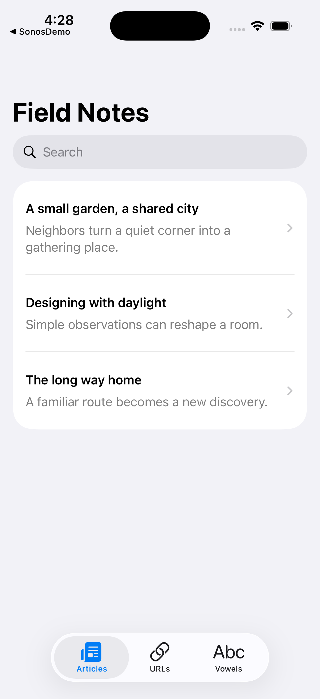

# Coding Challenges

Three small Swift exercises, rebuilt as an offline SwiftUI playground. Learn asynchronous state, URL semantics and local persistence without API keys, login or a database server.



Requires Swift tools 6.3 / Xcode 26.6; iPhone and iPad on iOS 18+. ChallengeKit also builds on macOS 15+.

```sh
git clone https://github.com/JimmyJammed/coding-challenges.git
cd coding-challenges
swift test
open CodingChallenges.xcodeproj
```

Run the CodingChallenges scheme. All three tabs work offline; the URL tab makes requests only when live checking is enabled.

| Exercise | Learning objectives |
|---|---|
| Article Browser | Async loading, search/refresh, navigation, sharing, lifecycle-safe WebKit |
| URL Validator | Parse versus reachability, HTTPS defaults, bounded requests and cancellation |
| Vowel Counter | Explicit text semantics, actor-isolated JSON persistence and history |

[API](docs/API.md) · [Architecture](docs/ARCHITECTURE.md) · [Customization](docs/CUSTOMIZATION.md) · [Migration](docs/MIGRATION.md) · [Troubleshooting](docs/TROUBLESHOOTING.md) · [Validation](docs/VALIDATION.md) · [Contributing](CONTRIBUTING.md) · [Changelog](CHANGELOG.md)

The original Swift/Objective-C/PHP/MySQL/Facebook implementations remain available at the documented [historical revision](docs/HISTORY.md). Existing licensing is preserved.
